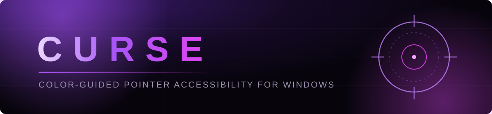
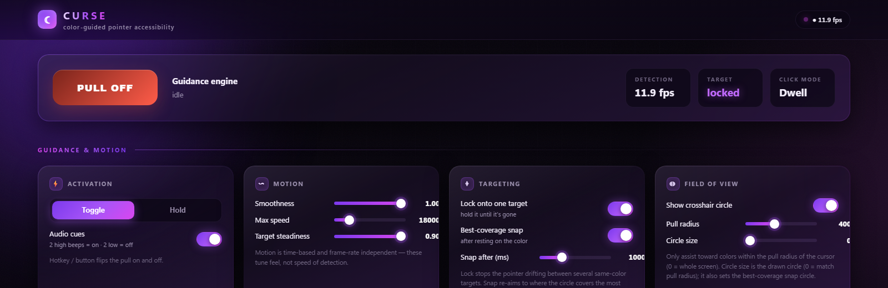
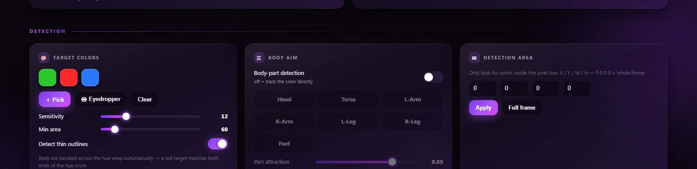
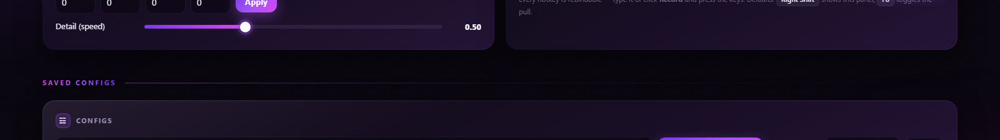

<div align="center">



[](#install)
[](#install)
[](#testing)
[](#testing)
[](#the-control-panel-web-ui)
[](LICENSE)

**An assistive-technology tool for people with limited hand movement, tremor,
or reduced pointing accuracy.**

*It helps a user who cannot reliably control a mouse place and activate the
pointer on things they want to interact with on their own screen.*

</div>

---

## ✨ The panel



| Detection & body aim | Saved configs |
|---|---|
|  |  |

<sub>Full-page screenshot: [docs/full.png](docs/full.png)</sub>

## 🚀 Feature highlights

- 🎯 **Color-guided pull** — pick any on-screen color (picker or eyedropper);
  the pointer eases toward it, smoothly and frame-rate independently.
- 🔒 **Single-target lock** — sticks to one target until it's gone; never
  drifts to the middle of a group or twitches between look-alikes.
- ⭕ **Best-coverage snap** — aim refines to where the circle covers the *most*
  color, after resting on it or instantly (0 ms) for targets that keep moving.
- 🧍 **Body aim** — Head / Torso / Arms / Legs / Feet targeting on a drawn
  figure, pose-adaptive bands, tunable part attraction.
- 🖱️ **Toggle or Hold activation** — flip with a hotkey, or stay active only
  while a mouse side button is held. Audio cues: 2 high beeps on, 2 low off.
- 🖲️ **Flexible clicking** — dwell auto-click, instant trigger key/button,
  repeat auto-fire, or fully manual.
- 💾 **Saved configs** — snapshot your whole setup under a unique code like
  `CRS-7KQ2XN`; load it back anywhere.
- 🫨 **Tremor steadying** — optionally damp physical mouse input while the
  assist is moving so a shaky hand doesn't fight it.
- 🧪 **Proven accuracy** — live-motion simulation suite; ≤2.5 px mean static
  error, ~10 px tracking error at 500 px/s.

---

## What it is

It captures the screen, detects a color the user chooses, and **gently guides the
mouse cursor toward that color**, so someone with low dexterity only has to move
roughly in the right direction — the software eases the pointer the rest of the
way. It was built for a specific person to help them interact with on-screen art
(for example, tracing or selecting parts of a hand-drawn figure) without needing
precise manual control.

The guidance is a smooth, gradual easing motion (never a jump), and — because
pressing a physical mouse button can itself be difficult — a click can be issued
automatically by resting the pointer on the target (**dwell**), by a chosen key,
or repeatedly for users who cannot click many times themselves. The control panel
is a local web page that opens in the user's browser.

### Purpose and scope

This is a **desktop accessibility aid** for the operator's *own* computer,
comparable in spirit to dwell-clicking, sticky keys, or head/eye pointer software
built into operating systems. It does not read or modify any other program; it
only looks at on-screen pixels and moves the pointer through the standard Windows
input path, exactly as an assistive mouse or trackball would.

> Windows only. Cursor movement and clicks go through the standard `SendInput`
> API — the same path a real mouse uses. The one optional exception is the
> "steady the pointer" feature, which uses a standard Windows low-level mouse
> hook (see [Input control](#controls)) to reduce the effect of hand tremor; it
> is off by default. Screen-pixel input only — nothing reads another process's
> memory.

---

## Install & run

**Download [`CursorAssist.exe`](https://github.com/slayfoids/curse-assist/releases)
from the latest release and double-click it.** That's the whole install — one
file, no Python, no packages, nothing to set up.

It starts the engine and opens the **web control panel** in your browser (a local
server on `http://127.0.0.1:8756`, loopback only — never exposed to the network).
A small console window stays open behind it; that's where errors would appear.

Two things to expect on a fresh PC, both normal for any unsigned program:

- Windows SmartScreen shows *"Windows protected your PC"* → **More info** →
  **Run anyway**. It only asks once.
- Antivirus may flag a self-extracting build. The exe is deliberately unpacked
  and unobfuscated so it can be inspected.

> **Setting it up for someone else?** [**INSTALL.md**](INSTALL.md) is the full
> step-by-step, with nothing assumed.

## Run from source

Only needed to change the code. Requires Python 3.10+ (with Tkinter, which ships
with the standard Windows CPython installer).

```bash
py -m pip install -r requirements.txt
py -m cursor_assist
```

If `keyboard` fails to install (it needs admin on some systems), the app still
runs — the global hotkey falls back to a window-focused key binding.

Options:

```bash
py -m cursor_assist --port 9000     # use a different port
py -m cursor_assist --no-browser    # don't auto-open; just print the URL
py -m cursor_assist --tk            # legacy Tkinter panel instead of the web UI
```

### Build the exe yourself

```bash
py -m pip install pyinstaller
py tools/build_exe.py
```

That produces **`dist/CursorAssist.exe`** (~67 MB — it carries its own Python,
OpenCV and numpy). The build is defined by [`CursorAssist.spec`](CursorAssist.spec)
and is plain and unobfuscated: the console stays enabled so a failure to start is
visible and screenshottable, and UPX packing is off (it trips antivirus
heuristics for no real gain). Set `console=False` in the spec for a no-console
build. Signing it with a code-signing certificate is the only real fix for the
SmartScreen prompt.

### Run in the background (no console window)

A from-source convenience: run with **no terminal window** left open — just the
control panel. Each launch gets a **randomly generated instance name** (also the
process name in Task Manager). Double-click
**`Start Cursor Assist (background).cmd`**, or:

```bash
py background\start_hidden.py
```

Stop it with **`Stop Cursor Assist.cmd`**, or:

```bash
py background\stop_hidden.py
```

Under the hood this runs the app with `pythonw.exe` (the windowless interpreter)
via a randomly named copy, and records the name + PID in `.runtime\instance.json`
so it's easy to find and stop. It is transparent, not stealthy — the control
panel stays visible and nothing auto-starts at boot unless you set that up
yourself (see [INSTALL.md](INSTALL.md#step-4--optional-start-it-automatically-at-login)).
See [background/start_hidden.py](background/start_hidden.py) for details.

### Capture options

```bash
# Capture a specific desktop region (left top width height):
py -m cursor_assist --region 100 100 1280 720

# Capture monitor 2 full-screen:
py -m cursor_assist --monitor 2

# Read a composited OBS scene via the OBS Virtual Camera instead of the desktop:
py -m cursor_assist --source obs --obs-index 0
```

Ordinary **desktop screen capture is the default** source. (An OBS Virtual
Camera source is also available for users who already run OBS, but it is not
required.)

---

## The control panel (web UI)

**Curse** — a full-width purple/black glass dashboard that opens in the user's
browser, organised into sectioned cards.
Everything is adjustable and **persists between runs** (saved to
`%LOCALAPPDATA%\CursorAssist\settings.json`). **Press Right Shift** any time to
re-open the panel tab.

Cards: **Motion** (smoothness, max speed, target steadiness) · **Click** (how the
click is issued: dwell / key / off, dwell time, radius, repeated clicks) ·
**Assist area** (how large an area around the pointer the tool responds to, shown
as a circle) · **Target colors** (one or more colors, picker, eyedropper,
sensitivity, min area, thin-outline) · **Targeting** (single-target lock,
best-coverage snap) · **Target region** (six buttons) ·
**Capture source** (Screen/OBS, monitor, region, detail) · **Detection area**
(limit the search to a pixel box) · **Input control** (steady the pointer against
tremor) · **Hotkeys** (all rebindable, with Record).

## How to use it

1. Launch the app — the panel opens in the browser.
2. Add one or more **Target colors**: **＋ Pick** a color, or use the
   **⦿ Eyedropper** and click the exact pixel on screen you want to match. Add as
   many as you like. Adjust **Sensitivity** until the status dot turns green —
   detection runs live even before guidance is turned on, so it can be set up
   first.
3. By default the tool **guides toward the color directly** (the nearest matching
   color to the pointer). Turn on **Body-part detection** only if you want to aid
   a specific region (Head / Torso / Arms / Legs) of a drawn figure.
4. Turn guidance **ON** (the button, or the *Toggle guidance* hotkey, default
   **F8**).
5. Move roughly toward the target; the pointer eases the rest of the way. Rest on
   it and, after the **Dwell time**, a click is issued automatically.

Set **Click mode** to *Key* to issue a click with a chosen key instead, or *Off*
to click manually. The on-screen **circle** shows the area around the pointer
within which the tool offers guidance.

### Controls

| Control | What it does |
|---|---|
| **Guidance ON/OFF** | Master toggle for cursor guidance (also the *Toggle guidance* hotkey). |
| **Activation mode** | **Toggle** (hotkey flips guidance on/off) or **Hold** (guidance is live only while a chosen key or mouse button — e.g. a side button — is physically held; releasing it stops the pull and cancels any pending dwell click instantly). |
| **Audio cues** | Two high-pitched beeps when guidance activates, two low-pitched beeps when it deactivates — from any path (hotkey, hold button, panel). Can be turned off. |
| **Smoothness** | 0 = responsive, 1 = long gentle glide. Motion is frame-rate independent. |
| **Max speed** | Cap on how fast the pointer moves (px/sec, up to 100000). Higher = keeps up with a color that moves quickly. |
| **Target steadiness** | Smooths out detection jitter so the pointer doesn't wobble. Adaptive: the filter eases off automatically as the target speeds up, so raising this steadies a resting target without adding lag to a moving one. |
| **Click mode** | **Dwell** (click after resting on the target), **Key** (a chosen key issues the click), or **Off** (click manually). |
| **Dwell time** | In dwell mode, how long to rest before a click is issued (50–1500 ms). |
| **Click key/button** | In key mode, what issues the click: a keyboard key, or a mouse button (RMB / MMB / side buttons) via quick-pick buttons — no need to record. |
| **Click radius** | How close to the target counts as "on it" for dwell. |
| **Higher click magnitude** | Issue clicks repeatedly while resting on the target — for users who can't click many times themselves. |
| **Click interval** | Time between repeated clicks (30–1000 ms). |
| **Assist radius** | Only guide toward colors within this distance of the pointer (0 = whole screen). |
| **Show circle** | Draw the assist-area circle around the pointer (green when a color is engaged). |
| **Target colors** | Add one or more colors via picker or on-screen **eyedropper**; click a swatch to remove. |
| **Sensitivity** | How closely a pixel must match the chosen color (higher = matches a wider range). |
| **Min area** | Ignores colored specks smaller than this (px²). |
| **Detect thin outlines** | Detect colored *outlines*, not just filled color. |
| **Lock onto one target** | Pick a single color blob and keep guiding toward *it* until it disappears (plus a short grace), then re-acquire. With several same-color targets on screen this prevents the pointer from drifting to the middle of the group or twitching between them. |
| **Best-coverage snap** | After the pointer has rested on the color for the set time (default 1 s), aim is refined to the spot where the drawn circle (**Circle size**, falling back to the assist radius) covers the *most* target color. |
| **Snap after (ms)** | How long the pointer must sit on the color before the best-coverage snap engages (0–3000 ms). **Set it to 0 for an instant snap:** the timed path only starts its clock once the pointer is *resting on* the color, which a moving target never allows — so 0 skips that gate entirely and refines aim from the first frame. |
| **Body-part detection** | Off (default) = guide to the color directly. On = aid a body region of a drawn figure. |
| **Target region** | When body-part detection is on, which region (Head/Torso/Arms/Legs/Feet) to aid. Bands adapt to the figure's pose (standing / crouching / prone). |
| **Part attraction** | How strongly the aim is drawn to the chosen part: 1.00 = exactly at the part, lower blends toward the figure's center of mass for steadiness. |
| **Saved configs** | Snapshot the entire current setup under a unique random code (e.g. `CRS-7KQ2XN`). List, load, or delete saved configs; click a code to copy it, or type a code to load it on another setup. |
| **Capture source** | Desktop screen (default) or an OBS virtual camera; monitor / region. |
| **Detail (speed)** | Detection downscale — lower = faster, higher = more detail. |
| **Detection area** | Restrict color detection to a pixel box (X/Y/W/H); 0 0 0 0 = whole frame. |
| **Steady the pointer** | While the tool is moving the pointer, reduce the effect of the user's own hand tremor so it doesn't fight the guidance (uses a Windows low-level mouse hook; clicks still pass). |
| **Hotkeys** | Rebind any hotkey — type it or click **Record** and press the keys. |
| **Reset / Quit** | Restore defaults · stop the app. Changes autosave. |

> **Hotkeys are fully rebindable.** Defaults are **Right Shift** (show panel) and
> **F8** (toggle guidance). Click **Record** and press any key or combo to
> rebind. Note Right Shift also still works as a normal Shift while typing —
> rebind it if that bothers you.

---

## How it works

```
 DETECTION thread (runs as fast as the source allows)
   screen / OBS vcam ─▶ (crop ROI) ─▶ downscale ─▶ HSV mask (all colors) ─▶ contours
       ─▶ color mode: lock onto one blob, hold it until it's gone   (default)
       ─▶ body-part mode: split figure into regions, target the active one
       ─▶ (after resting on color) snap to the max-coverage circle position
       ─▶ teleport guard + deadband ─▶ one-euro smoothing ─▶ publishes target ─┐
                                                          │  (shared target)
 MOVEMENT thread (~240 Hz, independent)                   ▼
   read latest target ─▶ time-based ease: new = cur + (target-cur)·α(dt)
       ─▶ SendInput relative move (speed-capped) ─▶ dwell timer ─▶ click
       ─▶ (optional) steady the pointer against hand tremor
```

**Why it's smooth:** motion and detection are **decoupled**. The pointer is eased
by a dedicated high-rate loop using *time-based* smoothing (`α = 1 − e^(−dt/τ)`),
so it glides smoothly regardless of how fast detection runs. Detection runs on a
downscaled frame for speed and only *publishes* a target; a slow detection frame
no longer makes the pointer stutter. Smoothing the **target** (not the pointer)
removes detection jitter; the speed cap prevents any sudden jump.

**Why it's stable:** the tracker **locks onto one blob** and re-identifies it
each frame by position, so the choice of target can't flip-flop between several
same-color blobs (the cause of mid-group drift and random spasms). A **teleport
guard** treats discontinuous target jumps as a new target — resetting velocity
and smoothing instead of feeding them into motion prediction — and prediction
only engages after the velocity estimate has warmed up on a target. A small
**deadband** ignores sub-pixel detection wiggle so a still target is rock
steady.

**How steadiness works:** jitter and lag pull in opposite directions — smoothing
hard kills detection noise on a resting target but drags behind a moving one,
and a single fixed blend has to be bad at one of them. The target is filtered
with a **one-euro filter** (Casiez et al.), whose cutoff rises with the target's
own measured speed: a still target is filtered heavily and precisely, a fast one
is followed almost immediately. Because the coefficient is derived from real
elapsed time rather than applied once per frame, the same **Target steadiness**
setting behaves identically at 30 fps and 120 fps.

Two things feed it. The **velocity estimate** is itself low-passed (`VEL_CUTOFF_HZ`)
— it drives both the adaptive cutoff and the motion lead, so its lag is the
system's lag; it is deliberately fast. And the **teleport guard** judges a jump
by whether it lands where the current velocity predicted, not by raw speed: a
genuinely fast target stays consistent with its own velocity, while a blob
re-identification error lands somewhere unrelated. Judging on speed alone made
anything crossing the screen quickly look like a teleport, resetting the track
mid-flight and throwing away the velocity the lead depends on.

### Modules

| File | Responsibility |
|---|---|
| `config.py` | Thread-safe shared state (`AppState`, `ColorTarget`, capture config). |
| `capture.py` | `mss` screen capture and OBS virtual-camera capture. |
| `detection.py` | HSV masking (multi-color), contour finding, shape classification. |
| `segmentation.py` | Split a figure's bounding box into named body regions. |
| `targeting.py` | Target lock, best-coverage snap, teleport guard, one-euro smoothing + lead (downscale-aware). |
| `cursor.py` | `SendInput` relative move + click; time-based ease; dwell machine. |
| `mouse_block.py` | Optional low-level hook to steady the pointer against tremor. |
| `overlay.py` | Transparent click-through assist-area circle overlay. |
| `controller.py` | Decoupled detection + ~180 Hz movement threads. |
| `webserver.py` | Local HTTP server + JSON API for the web UI. |
| `webpage.py` | The self-contained dark web control panel (HTML/CSS/JS). |
| `gui.py` | Legacy Tkinter panel (`--tk`). |
| `persistence.py` | Save/load all settings to JSON so they persist. |

## Body-region heuristics

Regions are derived proportionally from the figure's bounding box: Head is the
top ~15%, Torso the next ~40% (center width), Arms the outer thirds of that same
band, and Legs the bottom ~45% split on the vertical midline. **L-Arm / R-Arm**
and **L-Leg / R-Leg** are labeled from the *viewer's* perspective. These are
intentionally coarse — good enough to bias the cursor, and the operator can
switch regions at any time.

## Notes & limitations

- Best results come from a clean, saturated target color against a contrasting
  background. Tune tolerance if detection flickers.
- Windows display scaling (DPI) can offset coordinates; run at 100% scaling, or
  capture the region you actually work in, for the tightest mapping.
- The tool assumes the largest colored contour is the figure. Busy scenes with
  large same-colored areas may need a tighter color/tolerance or a capture region.

### Live-motion simulation suite

`tests/test_sim_scenarios.py` drives the **real** engine (detection + movement
threads) against synthetic scenes in real time: static shapes of several kinds
and sizes (discs, square, triangle, thin ring), approaches from various
distances, linear tracking at 200/500/900 px/s, fast circular pursuit, lock
stability next to a same-color distractor, best-coverage snap on a concave
shape, and Head/Torso/Feet attraction on a humanoid figure moving at 250 px/s.
Runs as part of `pytest` (~30 s).

## Testing

Pure-logic pieces (segmentation, color helpers, glider convergence, persistence)
have unit tests that run without a display or camera:

```bash
py -m pytest -q
```

### Pointing-accuracy simulation

`tools/aim_sim.py` drives the **real** engine (detection + movement threads,
targeting, easing, dwell) against a synthetic colored target using a *virtual*
pointer — no display, camera, or real mouse. It measures how close the pointer
gets to the color (stationary) and how well it follows a color that moves:

```bash
py tools/aim_sim.py
```

Current results — stationary final error **~1.7 px** (settles ~0.4 s), circling
color **~11 px** on default settings. This harness is how the "doesn't fully
reach the color" bug (an easing step that rounded sub-pixel moves to zero and
stopped ~13 px short) was found and fixed. Accuracy comes from a sub-pixel
accumulator that lands exactly on the target, plus a small motion prediction
that anticipates a moving color (disabled when the color is stationary, so it
never costs precision).

### Strafe simulation (watchable)

`tools/strafe_sim.py` is the same idea for the hard case: a target juking
rapidly up and down, which is where tracking visibly falls apart. It renders the
target, the pointer, the error between them and fading trails for both, so the
failure is something you can watch rather than infer from a number.

```bash
py tools/strafe_sim.py --live                # watch it live
py tools/strafe_sim.py --record strafe.mp4   # save a run
py tools/strafe_sim.py --sweep               # error table across strafe speeds
```

It reports **signed** vertical error, so lag (pointer behind the target) is
distinguishable from overshoot (pointer flung past it) — they look identical in
a mean-absolute-error number and have opposite fixes.

This is how two motion bugs were found. The velocity estimator used a fixed
per-frame blend that worked out to a **~100 ms lag at 60 fps**; for a target
reversing twice a second that is most of a half-cycle, so the lead it fed
pointed where the target *had* been and threw the pointer the wrong way on
every direction change. And the teleport guard fired on any jump above
3000 px/s, which a fast strafe exceeds, resetting the track mid-flight. On a
1 Hz strafe the pointer went from **29% to 69%** of the time on target, with
peak error dropping from **74 px to 40 px**.

## License

MIT — see [LICENSE](LICENSE).
